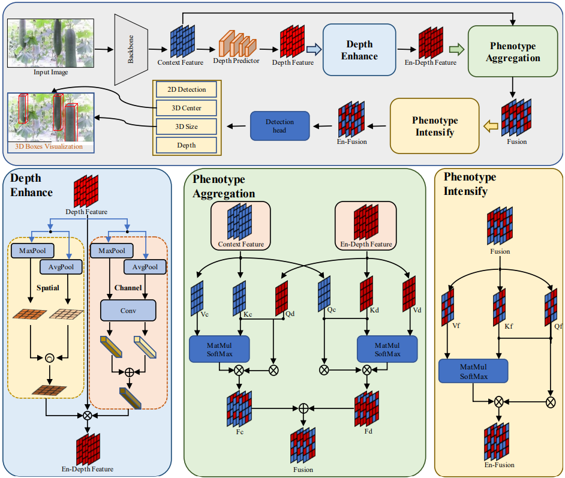
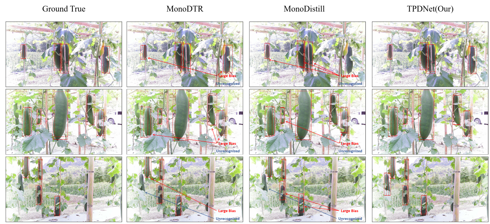

# TPDNet

**Count-Supervised Network (CSNet)**  can capture the 3D information of objects from a single RGB image for fruits and vegetables in fields.

paper: TPDNet: Triple phenotype deepen networks for Monocular 3D Object Detection of Melons and Fruits in Fields

## The Overview of CSNet



## About Data
We use the Wax Gourd 3D Object Detection DataSets ([dataset](http://tpdnet.samlab.cn/download.html)).


## Training
```
./launcher/eval.sh config/config.py
```
## Testing
```
./launcher/eval.sh config/config.py
```

## Result

